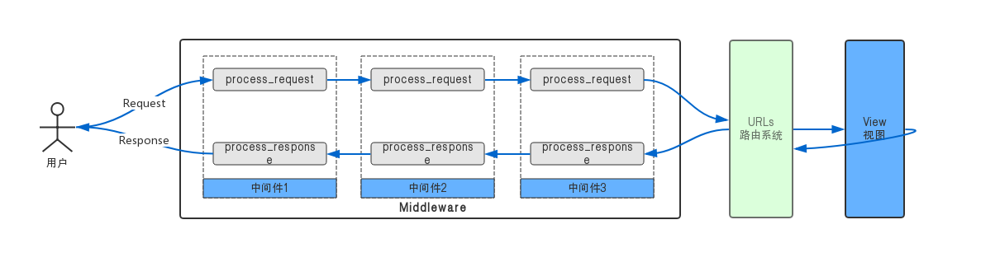

## Django中间件的调用过程

### 1. 准备utils app
- 进入项目apps目录
- 创建utils app: `cd apps && django-admin startapp utils`
- 查看目录：`tree`
```bash
(env_django) ➜  apps git:(master) ✗ tree
.
└── utils
    ├── __init__.py
    ├── admin.py
    ├── apps.py
    ├── migrations
    │   └── __init__.py
    ├── models.py
    ├── tests.py
    └── views.py
```

### 2. 添加三个中间件
- 文件：`apps/utils/middlewares/process.py`

```python
# -*- coding:utf-8 -*-
"""
演示中间件调用过程而创建的三个中间件
"""

from django.utils.deprecation import MiddlewareMixin


class StepOneMiddleware(MiddlewareMixin):
    """
    第一个Middleware
    """
    def process_request(self, request):
        print("Step One Middleware process_request running...")

    def process_response(self, request, response):
        print("Step One Middleware process_response running...")


class StepTwoMiddleware(MiddlewareMixin):
    """
    第二个Middleware
    """
    def process_request(self, request):
        print("Step Two Middleware process_request running...")

    def process_response(self, request, response):
        print("Step Two Middleware process_response running...")


class StepThreeMiddleware(MiddlewareMixin):
    """
    第三个Middleware
    """
    def process_request(self, request):
        print("Step Three Middleware process_request running...")

    def process_response(self, request, response):
        print("Step Three Middleware process_response running...")       
```

### 3. 修改settings.py中的中间件配置
- 把`utils`加入到`INSTALLED_APPS`
- 注释掉默认的中间件，把自己创建的三个中间件加入到`MIDDLEWARE`中

```diff
@@ -37,6 +39,8 @@ INSTALLED_APPS = [
     'django.contrib.sessions',
     'django.contrib.messages',
     'django.contrib.staticfiles',
+    # 自定义的app
+    'utils',
 ]
 
 MIDDLEWARE = [
@@ -47,6 +51,10 @@ MIDDLEWARE = [
     'django.contrib.auth.middleware.AuthenticationMiddleware',
     'django.contrib.messages.middleware.MessageMiddleware',
     'django.middleware.clickjacking.XFrameOptionsMiddleware',
+    # 自定义中间件
+    'utils.middlewares.process.StepOneMiddleware',
+    'utils.middlewares.process.StepTwoMiddleware',
+    'utils.middlewares.process.StepThreeMiddleware',
 ]
 
 ROOT_URLCONF = 'codelieche.urls'
 ```

 #### 4. 启动django服务
```bash
(env_django) ➜  source git:(master) ✗ python manage.py runserver 0:9090
Watching for file changes with StatReloader
Performing system checks...
......
May 15, 2019 - 03:18:56
Django version 2.2.1, using settings 'codelieche.settings'
Starting development server at http://0:9090/
Quit the server with CONTROL-C.
```

#### 5. 访问服务
```bash
curl http://127.0.0.1:9090/
```
可以在启动server的窗口看到：
```
Step One Middleware process_request running...
Step Two Middleware process_request running...
Step Three Middleware process_request running...
Step Three Middleware process_response running...
Step Two Middleware process_response running...
Step One Middleware process_response running...
```

**注意：**这里重点关注三个中间件的调用顺序，其它错误信息等可先忽略。

