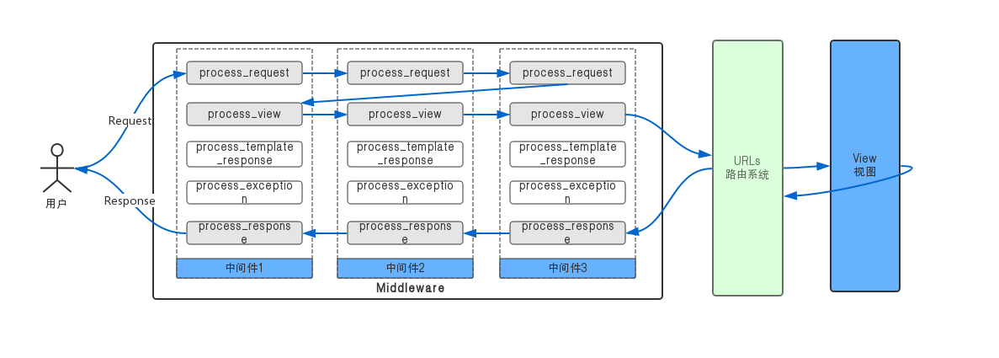
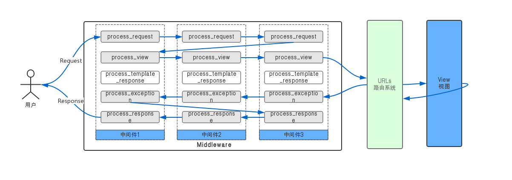
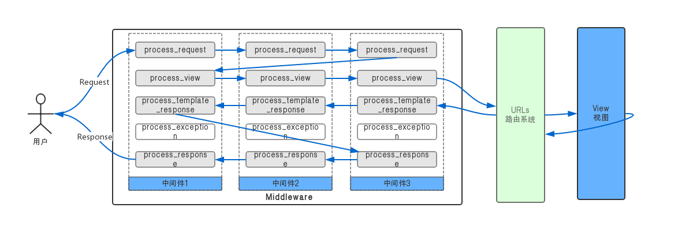
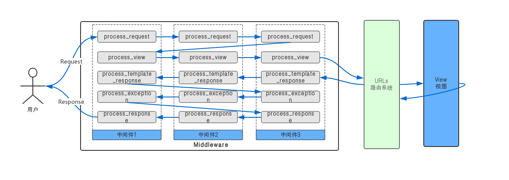

## Django中间件的调用过程02
> 在[Django中间件的调用过程01](./01-中间件的调用过程01.md)中只演示了`process_request`，`process_response`两个方法的调用顺序。

在接下来的内容中，我们把另外三个支持的函数加入：`process_view`、`process_template_response`、`process_exception`。

### 三个中间件钩子函数

#### process_view

```
process_view(request, view_func, view_args, view_kwargs)
```
  1. `request`: request参数是HttpRequest对象
  2. `view_func`: Django即将使用的Python函数
  3. `view_args`: 是传给视图函数的参数列表：`*args`
  4. `view_kwargs`: 是传递给视图的键值对字典参数：`**kwargs`,包括`request`
   
   > 它应该返回一个None或一个`HttpResponse`对象，如果它返回None，Django将继续处理此请求，执行其他的`process_view`中间件，然后是响应的视图。  
   如果它返回一个`HttpResponse`对象，Django将不会调用视图函数了，它将响应中间件，直接去调用最后一个中间件的`process_response`.

#### process_template_response

```
process_template_response(request, response)
```
  1. `request`: HttpRequest对象
  2. `response`: response是`TemplateResponse` Django视图或中间件返回的对象。
   > `process_template_response()`在视图完成执行后调用，如果响应示例有一个`render()`方法，表明它是一个`TemplateResponse`或等价的。  
   它必须返回response对象。

#### process_exception
```
process_exception(request, exception)
```
  1. `request`: HttpRequest对象
  2. `exception`: 是Exception视图函数引发的对象。
   > `process_exception()`在视图引发异常时调用。`process_exception()`应该返回一个None或一个`HttpResponse`对象。  
   如果它返回一个`HttpResponse对象，将应用模板响应和响应中间件，并将结果返回给浏览器。

### 准备
> 需要查看中间件的调用过程，那么需要准备个视图。我们让首页返回`Hello Django`。

#### 模板文件
- 文件地址：`templates/index.html`
- 文件内容
  
```html
<!DOCTYPE html>
<html lang="en">
<head>
    <meta charset="UTF-8">
    <title>Django Study Project</title>
</head>
<body>
    <h1>Hello Django</h1>
</body>
</html>
```

#### 添加视图函数
- 文件路径：`apps/utils/views/index.py`
- 代码内容
  
```python
# -*- coding:utf-8 -*-
from django.shortcuts import render


def page_index(request):
    print("index view function running...")
    return render(request=request, template_name="index.html")
```

#### 配置路由
- 文件路径：`codelieche/urls.py`
- 文件变更

```diff
 from django.contrib import admin
 from django.urls import path
 
+from utils.views.index import page_index
+
 urlpatterns = [
     path('admin/', admin.site.urls),
+
+    path('', page_index),
 ]
```

#### 现在的文件目录结构

```bash
➜  books git:(master) ✗ tree django/project/source
django/project/source
├── apps
│   └── utils
│       ├── __init__.py
│       ├── admin.py
│       ├── apps.py
│       ├── middlewares
│       │   ├── __init__.py
│       │   └── process.py    # 中间件文件
│       ├── migrations
│       │   ├── __init__.py
│       ├── models.py
│       ├── tests.py
│       └── views
│           ├── __init__.py
│           └── index.py      # 首页视图函数
├── codelieche
│   ├── __init__.py
│   ├── settings.py           # 修改里面配置：MIDDLEWARE中添加中间件
│   ├── urls.py               # 路由设置
│   └── wsgi.py
├── db.sqlite3
├── manage.py
├── requirements.txt
└── templates
    └── index.html
```

#### 再次访问网站首页

```
Step One Middleware process_request running...
Step Two Middleware process_request running...
Step Three Middleware process_request running...
index view function running...
Step Three Middleware process_response running...
Step Two Middleware process_response running...
Step One Middleware process_response running...
[15/May/2019 07:20:08] "GET / HTTP/1.1" 200 163
```

**处理流程：图1：**


### 添加三个钩子函数

- 文件：`apps/utils/middlewares/process.py`
- 最新代码：
  
```python
# -*- coding:utf-8 -*-
"""
演示中间件调用过程而创建的三个中间件
"""

from django.utils.deprecation import MiddlewareMixin


class StepOneMiddleware(MiddlewareMixin):
    """
    第一个Middleware
    """
    def process_request(self, request):
        print("\nStep One Middleware process_request running...")

    def process_view(self, request, view_func, view_args, view_kwargs):
        print("\nStep One Middleware process_view running......")

    def process_template_response(self, request, response):
        print("Step One Middleware process_template_response running...\n")
        return response

    def process_exception(self, request, exception):
        print("Step One Middleware process_exception running...\n")

    def process_response(self, request, response):
        print("Step One Middleware process_response running...\n")
        return response


class StepTwoMiddleware(MiddlewareMixin):
    """
    第二个Middleware
    """
    def process_request(self, request):
        print("Step Two Middleware process_request running...")

    def process_view(self, request, view_func, view_args, view_kwargs):
        print("Step Two Middleware process_view running......")

    def process_template_response(self, request, response):
        print("Step Two Middleware process_template_response running...")
        return response

    def process_exception(self, request, exception):
        print("Step Two Middleware process_exception running...")

    def process_response(self, request, response):
        print("Step Two Middleware process_response running...")
        return response


class StepThreeMiddleware(MiddlewareMixin):
    """
    第三个Middleware
    """
    def process_request(self, request):
        print("Step Three Middleware process_request running...")

    def process_view(self, request, view_func, view_args, view_kwargs):
        print("Step Three Middleware process_view running......\n")

    def process_template_response(self, request, response):
        print("\nStep Three Middleware process_template_response running...")
        return response

    def process_exception(self, request, exception):
        print("Step Three Middleware process_exception running...")

    def process_response(self, request, response):
        print("Step Three Middleware process_response running...")
        return response
```

#### 再次访问首页
- `curl http://127.0.0.1:9090/`
- 运行server的终端输出日志

```
Step One Middleware process_request running...
Step Two Middleware process_request running...
Step Three Middleware process_request running...
Step One Middleware process_view running......
Step Two Middleware process_view running......
Step Three Middleware process_view running......
index view function running...
Step Three Middleware process_response running...
Step Two Middleware process_response running...
Step One Middleware process_response running...
[15/May/2019 07:36:32] "GET / HTTP/1.1" 200 163
```

**处理流程：图2：**


**通过输出得到的信息有：**
1. 先执行了`process_request`：由前到后依次调用
2. 然后调用了中间件的`process_view`，由前到后
3. 调用view 视图函数
4. 调用中间件的`process_response`,**由后往前**
5. 用户(浏览器)得到了响应

同时可以看到: `process_template_response`和`process_exception`并未调用。

### 触发process_exception调用

#### 修改page_index函数
- 文件：`apps/utils/views/index.py`
  
```python
# -*- coding:utf-8 -*-
# from django.shortcuts import render
from django.http.response import Http404


def page_index(request):
    print("index view function running...")
    raise Http404()
    # return render(request=request, template_name="index.html")
```

#### 再次访问测试
- `curl http://127.0.0.1:9090/`
- 查看输出日志

```
Starting development server at http://127.0.0.1:9090/
Quit the server with CONTROL-C.
Step One Middleware process_request running...
Step Two Middleware process_request running...
Step Three Middleware process_request running...

Step One Middleware process_view running......
Step Two Middleware process_view running......
Step Three Middleware process_view running......

index view function running...

Step Three Middleware process_exception running...
Step Two Middleware process_exception running...
Step One Middleware process_exception running...

Step Three Middleware process_response running...
Step Two Middleware process_response running...
Step One Middleware process_response running...

Not Found: /
[15/May/2019 07:58:08] "GET / HTTP/1.1" 404 1685
```
可以看出：`process_exception`是从后到前调用的，调用完了之后再`process_response`。

**处理流程：图3：**


### 触发process_template_response调用

#### 修改page_index函数
- 文件：`apps/utils/views/index.py`
  
```python
# -*- coding:utf-8 -*-
from django.shortcuts import render
# from django.http.response import Http404

class PageIndex:

    def __init__(self, request):
        self.request = request

    def render(self):
        return render(request=self.request, template_name="index.html")


def page_index(request):
    print("index view function running...")
    # raise Http404()
    # return render(request=request, template_name="index.html")
    instance = PageIndex(request)
    return instance
```

#### 再次访问测试
- `curl http://127.0.0.1:9090/`
- 查看输出日志
  
```
Step One Middleware process_request running...
Step Two Middleware process_request running...
Step Three Middleware process_request running...

Step One Middleware process_view running......
Step Two Middleware process_view running......
Step Three Middleware process_view running......

index view function running...

Step Three Middleware process_template_response running...
Step Two Middleware process_template_response running...
Step One Middleware process_template_response running...

[15/May/2019 08:14:59] "GET / HTTP/1.1" 200 163

Step Three Middleware process_response running...
Step Two Middleware process_response running...
Step One Middleware process_response running...
```
可以看到触发了`process_template_response`的调用，是由后到前的。

**处理流程：图4：**



### 五个钩子函数全部调用

#### 修改index视图函数
- 文件：`apps/utils/views/index.py`
  
```python
# -*- coding:utf-8 -*-
# from django.shortcuts import render
from django.http.response import Http404


class PageIndex:

    def __init__(self, request):
        self.request = request

    def render(self):
        # return render(request=self.request, template_name="index.html")
        raise Http404()


def page_index(request):
    print("index view function running...")
    # raise Http404()
    # return render(request=request, template_name="index.html")
    instance = PageIndex(request)
    return instance
```

#### 访问并查看日志
- `curl http://127.0.0.1:9090/`
- 输出日志

```
Step One Middleware process_request running...
Step Two Middleware process_request running...
Step Three Middleware process_request running...

Step One Middleware process_view running......
Step Two Middleware process_view running......
Step Three Middleware process_view running......

index view function running...

Step Three Middleware process_template_response running...
Step Two Middleware process_template_response running...
Step One Middleware process_template_response running...

Step Three Middleware process_exception running...
Step Two Middleware process_exception running...
Step One Middleware process_exception running...

Step Three Middleware process_response running...
Step Two Middleware process_response running...
Step One Middleware process_response running...

Not Found: /
[15/May/2019 08:20:58] "GET / HTTP/1.1" 404 1685
```

**处理流程：图5：**

正常的响应是不会触发`process_exception`的调用的，会是**图2**或者**图4**的流程。


