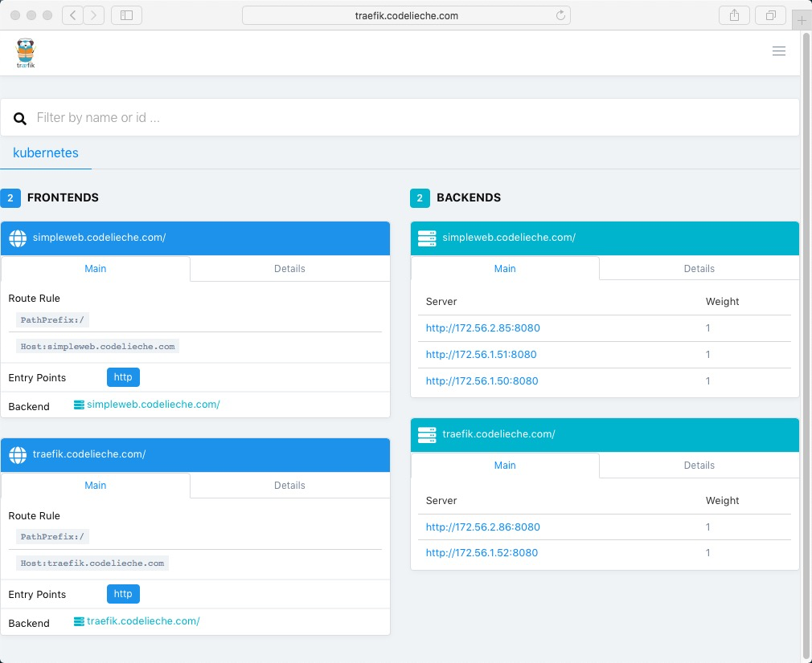

## 通过Ingress暴露服务

> 我们可以通过：**NodePort**和**LoadBalancer**，暴露服务给集群外面的客户端。
>
> 我们还可以通过**Ingress**暴露服务给集群外面的客户端访问。
>
> **Ingress**：入口、准许进入，进入的行为。

**参考文档**：

- https://traefik.io/
- https://github.com/kubernetes/ingress-nginx
- https://kubernetes.io/docs/concepts/services-networking/ingress/

**在使用Ingress对象提供的功能之前，请选确保kubernetes集群中有Ingress Controller运行！**

### 创建Ingress

#### 准备资源文件

- 定义Ingress资源文件：`simpleweb-ingress.yaml`

  ```bash
  apiVersion: extensions/v1beta1
  kind: Ingress
  metadata:
    name: simpleweb
    labels:
      app: simpleweb
  spec:
    rules:
    - host: simpleweb.codelieche.com
      http:
        paths:
        - path: /
          backend:
            serviceName: simpleweb
            servicePort: 80
  ```

- 创建个Deployment和Service: `simpleweb-deployment-service.yaml`

  ```yaml
  apiVersion: apps/v1
  kind: Deployment
  metadata:
    name: simpleweb
    labels:
      app: simpleweb
  spec:
    replicas: 3
    selector:
      matchLabels:
        app: simpleweb
    template:
      metadata:
        labels:
          app: simpleweb
      spec:
        containers:
        - name: simpleweb
          image: codelieche/simpleweb:v1
          ports:
          - containerPort: 8080
            name: http
  ---
  apiVersion: v1
  kind: Service
  metadata:
    name: simpleweb
    labels:
      app: simpleweb
  spec:
    selector:
      app: simpleweb
    ports:
    - port: 80
      targetPort: 8080
    type: ClusterIP
  ```

#### 创建相关资源

- 创建Deployment和Service

  - 创建：

    ```bash
    root@ubuntu238:~# kubectl apply -f simpleweb-deployment-service.yaml
    deployment.apps/simpleweb created
    service/simpleweb created
    ```

  - 查看：

    ```bash
    root@ubuntu238:~# kubectl get deployments
    NAME        READY   UP-TO-DATE   AVAILABLE   AGE
    simpleweb   3/3     3            3           58s
    root@ubuntu238:~# kubectl get service
    NAME         TYPE        CLUSTER-IP     EXTERNAL-IP   PORT(S)   AGE
    kubernetes   ClusterIP   10.112.0.1     <none>        443/TCP   5d3h
    simpleweb    ClusterIP   10.125.22.94   <none>        80/TCP    63s
    ```

- 创建Ingress资源：

  - 创建：

    ```bash
    root@ubuntu238:~# kubectl apply -f simpleweb-ingress.yaml
    ingress.extensions/simpleweb created
    ```

  - 查看：

    ```bash
    root@ubuntu238:~# kubectl get ingresses simpleweb
    NAME        HOSTS                      ADDRESS   PORTS   AGE
    simpleweb   simpleweb.codelieche.com             80      45s
    ```

  - 查看详细的信息：

    ```bash
    root@ubuntu238:~# kubectl get ingresses simpleweb
    NAME        HOSTS                      ADDRESS   PORTS   AGE
    simpleweb   simpleweb.codelieche.com             80      45s
    root@ubuntu238:~# kubectl describe ingresses simpleweb
    Name:             simpleweb
    Namespace:        default
    Address:
    Default backend:  default-http-backend:80 (<none>)
    Rules:
      Host                      Path  Backends
      ----                      ----  --------
      simpleweb.codelieche.com
                                /   simpleweb:80 (172.56.1.50:8080,172.56.1.51:8080,172.56.2.85:8080)
    # ....
    ```

- 通过域名访问Ingress暴露的服务

  1. 在测试机上修改hosts:

     ```bash
     echo "192.168.6.239 simpleweb.codelieche.com" >> /etc/hosts
     ```

  2. ping域名和curl

     ```bash
     root@ubuntu123:~# ping simpleweb.codelieche.com
     PING simpleweb.codelieche.com (10.90.1.239) 56(84) bytes of data.
     64 bytes from simpleweb.codelieche.com (10.90.1.239): icmp_seq=1 ttl=64 time=0.650 ms
     ```

     如果出现下面问题，也许是没有Ingress Crontroller运行在kubernetes集群中。

     ```bash
     root@ubuntu123:~# curl simpleweb.codelieche.com
     curl: (7) Failed to connect to simpleweb.codelieche.com port 80: Connection refused
     ```

     如果是minikube: 可通过`minikube addons enable ingress`启动`Ingress Crontroller`功能。
     
     **这时，可先安装好traefik，再尝试。**
     
  3. 再次curl：
  
     ```bash
     root@ubuntu123:~# curl simpleweb.codelieche.com
     Host:simpleweb-585cf79f77-ftg5m | IP:172.56.2.85 | Version:1
     
     root@ubuntu123:~# curl simpleweb.codelieche.com/api
     Api Page:/api | Version:1
     
     root@ubuntu123:~# curl simpleweb.codelieche.com/health
     Is OK!(13h30m41.900686562s) | Version:1
     ```
  
     

### 安装traefik

- 参考文档：https://docs.traefik.io/user-guide/kubernetes/

- 安装：

  - [traefik-rbac.yaml](https://github.com/containous/traefik/tree/v1.7/examples/k8s/traefik-rbac.yaml)

    ```bash
    kubectl apply -f ./traefic/traefik-rbac.yaml
    # 或者
    kubectl apply -f https://raw.githubusercontent.com/containous/traefik/v1.7/examples/k8s/traefik-rbac.yaml
    ```

  - [traefik-ds.yaml](https://github.com/containous/traefik/tree/v1.7/examples/k8s/traefik-ds.yaml)

    ```bash
    kubectl apply -f ./traefik/traefik-ds.yaml
    # 或者
    kubectl apply -f https://raw.githubusercontent.com/containous/traefik/v1.7/examples/k8s/traefik-ds.yaml
    ```

  - 安装

    ```bash
    root@ubuntu238:~# kubectl apply -f ./traefik/traefik-rbac.yaml
    clusterrole.rbac.authorization.k8s.io/traefik-ingress-controller created
    clusterrolebinding.rbac.authorization.k8s.io/traefik-ingress-controller created
    
    root@ubuntu238:~# kubectl apply -f ./traefik/traefik-ds.yaml
    serviceaccount/traefik-ingress-controller created
    daemonset.extensions/traefik-ingress-controller created
    service/traefik-ingress-service created
    ```

- 查看pod：

  ```bash
  root@ubuntu238:~# kubectl get pods -n kube-system | grep traefik
  traefik-ingress-controller-gmfxj    1/1     Running   0          67s
  traefik-ingress-controller-z8xkb    1/1     Running   0          67s
  
  root@ubuntu238:~# kubectl get pods -n kube-system -o wide | grep traefik
  traefik-ingress-controller-gmfxj    1/1     Running   0          77s     172.56.2.86   ubuntu240   <none>           <none>
  traefik-ingress-controller-z8xkb    1/1     Running   0          77s     172.56.1.52   ubuntu239   <none>           <none>
  ```

  可以看到

  - 开启了调度pod的节点都部署了traefik


#### 安装traefik UI

- 修改下traefik/ui.yaml

  ```yaml
  ---
  apiVersion: v1
  kind: Service
  metadata:
    name: traefik-web-ui
    namespace: kube-system
  spec:
    selector:
      k8s-app: traefik-ingress-lb
    ports:
    - name: web
      port: 80
      targetPort: 8080
  ---
  apiVersion: extensions/v1beta1
  kind: Ingress
  metadata:
    name: traefik-web-ui
    namespace: kube-system
  spec:
    rules:
    - host: traefik.codelieche.com
      http:
        paths:
        - path: /
          backend:
            serviceName: traefik-web-ui
            servicePort: web
  ```

- 安装：

  ```bash
  root@ubuntu238:~# kubectl apply -f ./traefik/ui.yaml
  service/traefik-web-ui created
  ingress.extensions/traefik-web-ui created
  
  root@ubuntu238:~# kubectl get ingresses --all-namespaces
  NAMESPACE     NAME             HOSTS                      ADDRESS   PORTS   AGE
  default       simpleweb        simpleweb.codelieche.com             80      13h
  kube-system   traefik-web-ui   traefik.codelieche.com               80      21m
  ```

- 修改hosts：

  ```bash
  echo "192.168.6.239 traefik.codelieche.com" >> /etc/hosts
  ```

- 访问traefik ui：

  ```bash
  root@ubuntu123:~# curl traefik.codelieche.com
  <a href="/dashboard/">Found</a>.
  ```

- 用浏览器打开traefik ui

  


### 最后：清理

- 删除Deployment：

  ```bash
  root@ubuntu238:~# kubectl delete deployments simpleweb
  deployment.extensions "simpleweb" deleted
  ```

- 删除Service：

  ```bash
  root@ubuntu238:~# kubectl delete service simpleweb
  service "simpleweb" deleted
  ```

- 删除Ingress：

  ```bash
  root@ubuntu238:~# kubectl delete ingresses simpleweb
  ingress.extensions "simpleweb" deleted
  ```