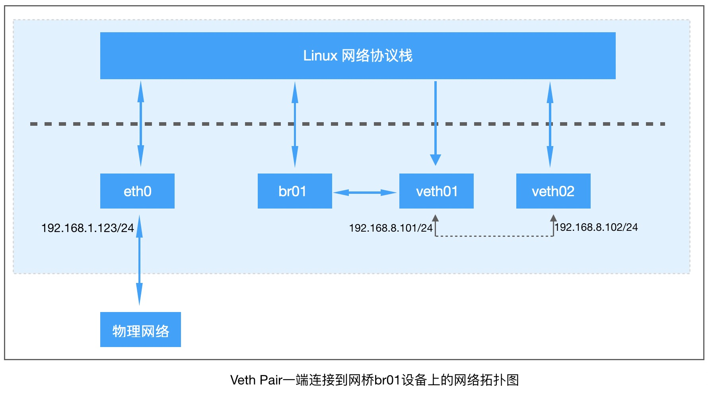
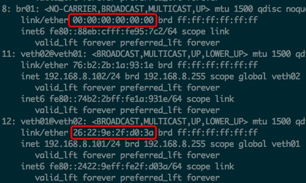
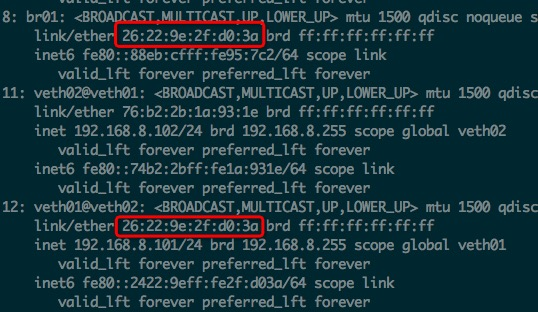
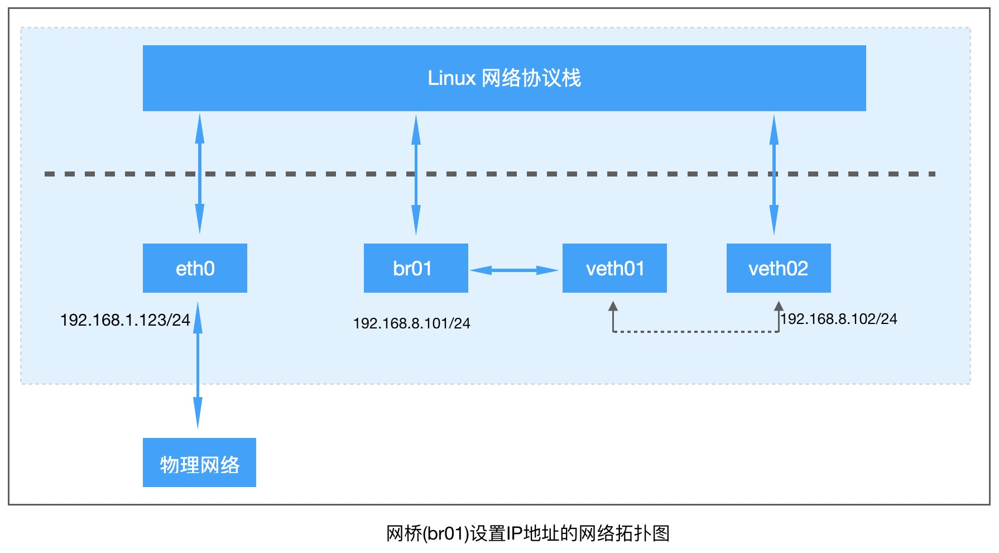

## Linux Bridge

> 当2台电脑需要连接，我们可以用一根网线，多台电脑相连就需要交换机了。
>
> 当2个network namespace需要连接，我们可以通过`veth pair`，如果多个network namespace需要相互连接，这个时候就需要`Linux Bridge`了。

网桥(Bridge)是一个二层网络设备，有**牵线搭桥**的的作用，用于连接不通的局域网，是网线的延伸。

`Linux Bridge`就是Linux系统中的网桥，其更像是一台虚拟的网络交换机。

任意的真实物理设备(比如：eth0)和虚拟设备(比如：veth pair)都可以连接到`Linux Bridge`上。

**Linux Bridge**有多个端口，数据可以从任何端口进来，进来之后从哪个口出去都取决于目的的MAC地址，原理和物理交换机差不多。


### 操作Linux Bridge

- **创建Bridge:**

  - 通过ip link子命令创建

    ```bash
    ip link add name br01 type bridge
    ```

    查看：

    ```bash
    root@ubuntu:~# ip link
    # ...
    8: br01: <BROADCAST,MULTICAST> mtu 1500 qdisc noop state DOWN mode DEFAULT group default qlen 1000
        link/ether 8a:eb:cf:95:07:c2 brd ff:ff:ff:ff:ff:ff
    ```

    启动这个网桥：

    ```bash
    ip link set br01 up
    ```

    再次执行`ip link`就可看到：

    ```
    8: br01: <BROADCAST,MULTICAST,UP,LOWER_UP> mtu 1500 qdisc noqueue state UNKNOWN mode DEFAULT group default qlen 1000
        link/ether 8a:eb:cf:95:07:c2 brd ff:ff:ff:ff:ff:ff
    ```

    状态是UP了。

  - **通过bridge-utils软件包里的brctl工具管理网桥**

    - 安装bridge-utils: `apt-get install bridge-utils`

    - 查看帮助：

      ```bash
      root@ubuntu:~# which brctl
      /sbin/brctl
      root@ubuntu:~# brctl help
      never heard of command [help]
      Usage: brctl [commands]
      commands:
      	addbr     	<bridge>		add bridge
      	delbr     	<bridge>		delete bridge
      	addif     	<bridge> <device>	add interface to bridge
      	delif     	<bridge> <device>	delete interface from bridge
      	hairpin   	<bridge> <port> {on|off}	turn hairpin on/off
      	setageing 	<bridge> <time>		set ageing time
      	setbridgeprio	<bridge> <prio>		set bridge priority
      	setfd     	<bridge> <time>		set bridge forward delay
      	sethello  	<bridge> <time>		set hello time
      	setmaxage 	<bridge> <time>		set max message age
      	setpathcost	<bridge> <port> <cost>	set path cost
      	setportprio	<bridge> <port> <prio>	set port priority
      	show      	[ <bridge> ]		show a list of bridges
      	showmacs  	<bridge>		show a list of mac addrs
      	showstp   	<bridge>		show bridge stp info
      	stp       	<bridge> {on|off}	turn stp on/off
      ```

    - 添加网桥：`brctl addr br01`

    - 删除网桥：`brctl delbr br01`

    - 添加网卡到网桥：`brctl addif br01 veth01`

    - 把网卡从网桥移除：`brctl delif br01 veth01`

### 实验

#### 实验1：把veth pair的一端插到网桥上

#### 1-1：把IP设置到veth pair上

**注意：**不同系统，不同内核配置，做实验出现的情况可能会不一样，需根据具体情况，具体分析。



**veth01和br01相连接后，发生了如下的变化**：

1. `veth01`和`br01`是双向通道
   - 发给`veth01`的数据包会立刻交给`br01`处理，以前是交给内核协议栈的
   - `br01`可以发送数据包给`veth01`
2. 协议栈和`veth01`之间，变成了**单通道**
   - 原来是`veth01`的数据包会交给协议栈，现在是给了`br01`
   - **协议栈是依然可以发数据给`veth01`的**
3. `br01`的MAC地址变成了`veth01`的MAC地址

- 准备veth pair:

  ```bash
  ip link add veth01 type veth peer name veth02
  ifconfig veth01 192.168.8.101/24 up
  ifconfig veth02 192.168.8.102/24 up
  
  # 修改相关配置
  # 由0设置为1
  echo 1 > /proc/sys/net/ipv4/conf/veth01/accept_local
  echo 1 > /proc/sys/net/ipv4/conf/veth02/accept_local
  # 由1改成0
  echo 0 > /proc/sys/net/ipv4/conf/all/rp_filter
  echo 0 > /proc/sys/net/ipv4/conf/veth01/rp_filter
  echo 0 > /proc/sys/net/ipv4/conf/veth02/rp_filter
  ```

  通过`ip addr`来检查。

  如果要删除veth pair可通过：`ip link delete dev veth01`

- 把`veth01`连接到`br01`上：

  通过`ip addr`查看ip地址和MAC：

  

  ```bash
  ip link set dev veth01 master br01
  # 或者
  brctl addif br01 veth01
  ```

  再次通过`ip addr`查看：

  

  **发现`br01`的MAC地址变成了`veth01`的了。**

- 查看网桥上连接的网络设备：

  - `bridge link`

    ```bash
    # bridge link
    10: veth01 state UP @veth02: <BROADCAST,MULTICAST,UP,LOWER_UP> mtu 1500 master br01 state forwarding priority 32 cost 2
    ```

  - `brctl show`

    ```bash
    # brctl show
    bridge name	bridge id		STP enabled	interfaces
    br01		8000.4683b3895f10	no		veth01
    ```

- **执行ping测试：**

  - 用veth01的接口来`ping 192.168.8.102`

    ```bash
    root@ubuntu:~# ping -c 3 -I veth01 192.168.8.102
    PING 192.168.8.102 (192.168.8.102) from 192.168.8.101 veth01: 56(84) bytes of data.
    64 bytes from 192.168.8.102: icmp_seq=1 ttl=64 time=0.080 ms
    64 bytes from 192.168.8.102: icmp_seq=2 ttl=64 time=0.047 ms
    64 bytes from 192.168.8.102: icmp_seq=3 ttl=64 time=0.049 ms
    
    --- 192.168.8.102 ping statistics ---
    3 packets transmitted, 3 received, 0% packet loss, time 1998ms
    rtt min/avg/max/mdev = 0.047/0.058/0.080/0.017 ms
    ```

  - 用veth02的接口来`ping 192.168.8.101`

    ```bash
    root@ubuntu:~# ping -c 3 -I veth02 192.168.8.101
    PING 192.168.8.101 (192.168.8.101) from 192.168.8.102 veth02: 56(84) bytes of data.
    
    --- 192.168.8.101 ping statistics ---
    3 packets transmitted, 0 received, 100% packet loss, time 2016ms
    ```

  - **抓包分析：**

    > 打开3个窗口，分别执行：
    >
    > ping -c 3 -I veth02 192.168.8.101
    >
    > tcpdump -n -i veth01
    >
    > tcpdump -n -i br01

    - `tcpdump -n -i veth01`

      ```bash
      # tcpdump -n -i veth01
      tcpdump: verbose output suppressed, use -v or -vv for full protocol decode
      listening on veth01, link-type EN10MB (Ethernet), capture size 262144 bytes
      10:21:10.812954 ARP, Request who-has 192.168.8.101 tell 192.168.8.102, length 28
      10:21:11.810777 ARP, Request who-has 192.168.8.101 tell 192.168.8.102, length 28
      10:21:12.810849 ARP, Request who-has 192.168.8.101 tell 192.168.8.102, length 28
      ```

    - `tcpdump -n -i br01`

      ```bash
      # tcpdump -n -i br01
      tcpdump: verbose output suppressed, use -v or -vv for full protocol decode
      listening on br01, link-type EN10MB (Ethernet), capture size 262144 bytes
      10:21:10.812954 ARP, Request who-has 192.168.8.101 tell 192.168.8.102, length 28
      10:21:11.810777 ARP, Request who-has 192.168.8.101 tell 192.168.8.102, length 28
      10:21:12.810849 ARP, Request who-has 192.168.8.101 tell 192.168.8.102, length 28
      ```

    - 分析：

      通过上面的2个抓包信息，得到如下信息：

      1. `veth01`本来要转发给协议栈的数据包，立刻交给了`br01`
      2. `br01`未响应`ARP Request`的包，`br01`丢弃了这个包

    - 修改内核参数：

      - 查看：

        ```bash
        cat /proc/sys/net/ipv4/conf/br01/accept_local
        # 0
        cat /proc/sys/net/ipv4/conf/br01/rp_filter
        # 1
        ```

      - 修改：

        ```bash
        echo 1 > /proc/sys/net/ipv4/conf/br01/accept_local
        
        echo 0 > /proc/sys/net/ipv4/conf/br01/rp_filter
        ```

    - 再次执行`ping -c 3 -I veth02 192.168.8.101`

      ```bash
      # ping -c 3 -I veth02 192.168.8.101
      PING 192.168.8.101 (192.168.8.101) from 192.168.8.102 veth02: 56(84) bytes of data.
      64 bytes from 192.168.8.101: icmp_seq=1 ttl=64 time=0.134 ms
      64 bytes from 192.168.8.101: icmp_seq=2 ttl=64 time=0.070 ms
      64 bytes from 192.168.8.101: icmp_seq=3 ttl=64 time=0.078 ms
      
      --- 192.168.8.101 ping statistics ---
      3 packets transmitted, 3 received, 0% packet loss, time 2000ms
      rtt min/avg/max/mdev = 0.070/0.094/0.134/0.028 ms
      ```

      **成功响应了：**

      同时tcpdump抓包的窗口出现了如下信息：

      ```
      10:31:49.107269 ARP, Reply 192.168.8.101 is-at 26:22:9e:2f:d0:3a, length 28
      10:31:49.107300 IP 192.168.8.102 > 192.168.8.101: ICMP echo request, id 43176, seq 1, length 64
      10:31:50.108369 IP 192.168.8.102 > 192.168.8.101: ICMP echo request, id 43176, seq 2, length 64
      10:31:51.107363 IP 192.168.8.102 > 192.168.8.101: ICMP echo request, id 43176, seq 3, length 64
      ```

- **清理操作：**

  ```bash
  # 把网卡从网桥上移除
  brctl delif br01 veth01
  # 删除veth pair
  ip link delete dev veth01
  # 删除网桥
  ip link set dev br01 down
  brctl delbr br01
  ```

  **为了降低干扰，推荐实验后删掉，新的实验的时候重新创建。**

  

  ---

#### 1-2: 把IP设置在网桥上



- 实验命令汇总：

  ```bash
  # 创建网桥和启动网桥
  brctl addbr br01
  ip link set dev br01 up
  
  # 添加veth pair 并给veth02设置IP
  ip link add veth01 type veth peer name veth02
  ip addr add 192.168.8.102/24 dev veth02
  ip link set dev veth02 up
  
  # 给网桥添加IP
  ip addr add 192.168.8.101/24 dev br01
  ip addr
  
  # 记得把另外一个veth也启动
  ip link set dev veth01 up
  
  # 把veth01插入到br01上
  brctl addif br01 veth01
  brctl show
  
  ip addr
  
  # 执行ping
  ping -c 3 -I br01 192.168.8.102
  ```

- 创建网桥和veth pair

  - 创建网桥并设置状态为UP：

    ```bash
    brctl addbr br01
    ip link set dev br01 up
    ```

  - 创建veth pair：

    ```bash
    ip link add veth01 type veth peer name veth02
    ```

  - 查看`ip addr`

    ```bash
    # ip addr
    16: br01: <BROADCAST,MULTICAST,UP,LOWER_UP> mtu 1500 qdisc noqueue state UNKNOWN group default qlen 1000
        link/ether b2:e1:15:95:05:cb brd ff:ff:ff:ff:ff:ff
        inet6 fe80::b0e1:15ff:fe95:5cb/64 scope link
           valid_lft forever preferred_lft forever
    17: veth02@veth01: <BROADCAST,MULTICAST,M-DOWN> mtu 1500 qdisc noop state DOWN group default qlen 1000
        link/ether 9a:ac:7f:b1:84:0e brd ff:ff:ff:ff:ff:ff
    18: veth01@veth02: <BROADCAST,MULTICAST,M-DOWN> mtu 1500 qdisc noop state DOWN group default qlen 1000
        link/ether 2a:cd:77:6c:85:ba brd ff:ff:ff:ff:ff:ff
    ```

- 设置IP地址：

  - 给`veth02`设置IP

    ```bash
    ip addr add 192.168.8.102/24 dev veth02
    ip link set dev veth02 up
    
    # 或者
    ifconfig veth02 192.168.8.102/24 up
    ```

  - 给`br01`设置IP

    ```bash
    ip addr add 192.168.8.101/24 dev br01
    ```

  - 再次查看`ip addr`

    ```bash
    # ip addr
    # ....
    16: br01: <BROADCAST,MULTICAST,UP,LOWER_UP> mtu 1500 qdisc noqueue state UNKNOWN group default qlen 1000
        link/ether b2:e1:15:95:05:cb brd ff:ff:ff:ff:ff:ff
        inet 192.168.8.101/24 scope global br01
           valid_lft forever preferred_lft forever
        inet6 fe80::b0e1:15ff:fe95:5cb/64 scope link
           valid_lft forever preferred_lft forever
    17: veth02@veth01: <NO-CARRIER,BROADCAST,MULTICAST,UP,M-DOWN> mtu 1500 qdisc noqueue state LOWERLAYERDOWN group default qlen 1000
        link/ether 9a:ac:7f:b1:84:0e brd ff:ff:ff:ff:ff:ff
        inet 192.168.8.102/24 scope global veth02
           valid_lft forever preferred_lft forever
    18: veth01@veth02: <BROADCAST,MULTICAST> mtu 1500 qdisc noop state DOWN group default qlen 1000
        link/ether 2a:cd:77:6c:85:ba brd ff:ff:ff:ff:ff:ff
    ```

- **把veth01插入到`br01`**

  ```bash
  root@ubuntu:~# brctl addif br01 veth01
  root@ubuntu:~# brctl show
  bridge name	bridge id		STP enabled	interfaces
  br01		8000.1a642603ab02	no		veth01
  ```

  设置veth01位up：

  ```bash
  ip link set dev veth01 up
  ```

  

- 执行ping操作：`br01 ping veth02`

  ```bash
  # ping -c 3 -I br01 192.168.8.102
  PING 192.168.8.102 (192.168.8.102) from 192.168.8.101 br01: 56(84) bytes of data.
  From 192.168.8.101 icmp_seq=1 Destination Host Unreachable
  From 192.168.8.101 icmp_seq=2 Destination Host Unreachable
  From 192.168.8.101 icmp_seq=3 Destination Host Unreachable
  
  --- 192.168.8.102 ping statistics ---
  3 packets transmitted, 0 received, +3 errors, 100% packet loss, time 1999ms
  ```

- 修改网卡配置参数：

  ```bash
  echo 1 > /proc/sys/net/ipv4/conf/veth01/accept_local
  echo 1 > /proc/sys/net/ipv4/conf/veth02/accept_local
  echo 1 > /proc/sys/net/ipv4/conf/br01/accept_local
  # 由1改成0
  echo 0 > /proc/sys/net/ipv4/conf/all/rp_filter
  echo 0 > /proc/sys/net/ipv4/conf/veth01/rp_filter
  echo 0 > /proc/sys/net/ipv4/conf/veth02/rp_filter
  echo 0 > /proc/sys/net/ipv4/conf/br01/rp_filter
  ```

  **可能：还需要修改：**

  ```bash
  cat /proc/sys/net/ipv4/conf/veth01/proxy_arp
  cat /proc/sys/net/ipv4/conf/veth02/proxy_arp
  cat /proc/sys/net/ipv4/conf/br01/proxy_arp
  # 都是0
  
  echo 1 > /proc/sys/net/ipv4/conf/br01/proxy_arp
  echo 1 > /proc/sys/net/ipv4/conf/veth01/proxy_arp
  echo 1 > /proc/sys/net/ipv4/conf/veth02/proxy_arp
  ```

- 再次执行ping：

  ```bash
  # ping -c 3 -I br01 192.168.8.102
  PING 192.168.8.102 (192.168.8.102) from 192.168.8.101 br01: 56(84) bytes of data.
  64 bytes from 192.168.8.102: icmp_seq=1 ttl=64 time=0.110 ms
  64 bytes from 192.168.8.102: icmp_seq=2 ttl=64 time=0.058 ms
  64 bytes from 192.168.8.102: icmp_seq=3 ttl=64 time=0.097 ms
  
  --- 192.168.8.102 ping statistics ---
  3 packets transmitted, 3 received, 0% packet loss, time 2000ms
  rtt min/avg/max/mdev = 0.058/0.088/0.110/0.023 ms
  ```

- 清理操作：

  ```bash
  # 把网卡从网桥上移除
  brctl delif br01 veth01
  # 删除veth pair
  ip link delete dev veth01
  # 删除网桥
  ip link set dev br01 down
  brctl delbr br01
  ```

  ---

  

