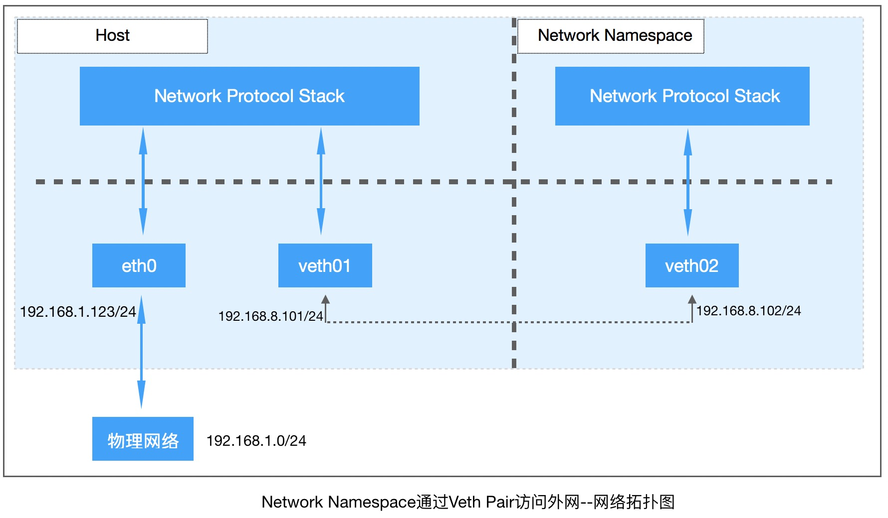

## 实验：自定义的Network Namespace访问外网

> 在本文中要做的事情就是，想创建个新的Network Namespace，然后让它可访问外网。




### 实验准备

**Network Namespace:**

- 创建个新的Network Namespace

  ```bash
  ip netns add test-ns
  ```

- 启动`test-ns`中的`lo`网卡设备

  ```bash
  root@ubuntu:~# ip netns exec test-ns ip addr
  1: lo: <LOOPBACK> mtu 65536 qdisc noop state DOWN group default qlen 1
      link/loopback 00:00:00:00:00:00 brd 00:00:00:00:00:00
  root@ubuntu:~# ip netns exec test-ns ip link set dev lo up
  root@ubuntu:~# ip netns exec test-ns ip addr
  1: lo: <LOOPBACK,UP,LOWER_UP> mtu 65536 qdisc noqueue state UNKNOWN group default qlen 1
      link/loopback 00:00:00:00:00:00 brd 00:00:00:00:00:00
      inet 127.0.0.1/8 scope host lo
         valid_lft forever preferred_lft forever
      inet6 ::1/128 scope host
         valid_lft forever preferred_lft forever
  ```

**Veth Pair:**

- 创建`veth pair`:

  ```bash
  ip net add veth01 type veth peer name veth02
  ```

- 查看Host的网卡：

  ```bash
  root@ubuntu:~# ip link
  # ...
  4: veth02@veth01: <BROADCAST,MULTICAST,M-DOWN> mtu 1500 qdisc noop state DOWN mode DEFAULT group default qlen 1000
      link/ether 06:20:80:0c:ce:98 brd ff:ff:ff:ff:ff:ff
  5: veth01@veth02: <BROADCAST,MULTICAST,M-DOWN> mtu 1500 qdisc noop state DOWN mode DEFAULT group default qlen 1000
      link/ether 92:4d:dd:bd:50:24 brd ff:ff:ff:ff:ff:ff
  ```
  
- 把`veth02`移动到`test-ns`

  ```bash
  ip link set veth02 netns test-ns
  ```

- 给`veth pari`分别设置IP地址

  ```bash
  ifconfig veth01 192.168.8.101/24 up
  ip netns exec test-ns ifconfig veth02 192.168.8.102/24 up
  ```

- 查看ip：

  - 查看Host的：

    ```bash
    # ip addr
    # ....
    5: veth01@if4: <BROADCAST,MULTICAST,UP,LOWER_UP> mtu 1500 qdisc noqueue state UP group default qlen 1000
        link/ether 92:4d:dd:bd:50:24 brd ff:ff:ff:ff:ff:ff link-netnsid 0
        inet 192.168.8.101/24 brd 192.168.8.255 scope global veth01
           valid_lft forever preferred_lft forever
        inet6 fe80::904d:ddff:febd:5024/64 scope link
           valid_lft forever preferred_lft forever
    ```

  - 查看`test-ns`的：

    ```bash
    # ip netns exec test-ns ip addr
    1: lo: <LOOPBACK,UP,LOWER_UP> mtu 65536 qdisc noqueue state UNKNOWN group default qlen 1
        link/loopback 00:00:00:00:00:00 brd 00:00:00:00:00:00
        inet 127.0.0.1/8 scope host lo
           valid_lft forever preferred_lft forever
        inet6 ::1/128 scope host
           valid_lft forever preferred_lft forever
    4: veth02@if5: <BROADCAST,MULTICAST,UP,LOWER_UP> mtu 1500 qdisc noqueue state UP group default qlen 1000
        link/ether 06:20:80:0c:ce:98 brd ff:ff:ff:ff:ff:ff link-netnsid 0
        inet 192.168.8.102/24 brd 192.168.8.255 scope global veth02
           valid_lft forever preferred_lft forever
        inet6 fe80::420:80ff:fe0c:ce98/64 scope link
           valid_lft forever preferred_lft forever
    ```

- 测试互`ping`:

  ```bash
  root@ubuntu:~# ping -c 1 192.168.8.102
  PING 192.168.8.102 (192.168.8.102) 56(84) bytes of data.
  64 bytes from 192.168.8.102: icmp_seq=1 ttl=64 time=0.037 ms
  
  --- 192.168.8.102 ping statistics ---
  1 packets transmitted, 1 received, 0% packet loss, time 0ms
  rtt min/avg/max/mdev = 0.037/0.037/0.037/0.000 ms
  
  root@ubuntu:~# ip netns exec test-ns ping -c 1 192.168.8.101
  PING 192.168.1.101 (192.168.8.101) 56(84) bytes of data.
  64 bytes from 192.168.8.101: icmp_seq=1 ttl=64 time=0.039 ms
  
  --- 192.168.8.101 ping statistics ---
  1 packets transmitted, 1 received, 0% packet loss, time 0ms
  rtt min/avg/max/mdev = 0.039/0.039/0.039/0.000 ms
  ```

- 测试ping外网：

  ```bash
  # ip netns exec test-ns ping www.codelieche.com
  ping: unknown host www.codelieche.com
  # ip netns exec test-ns ping 192.168.1.107
  connect: Network is unreachable
  ```

  

### 通过NAT转发数据包

> NAT Packet Forwarding.

- 系统设置：

  ```bash
  cat /proc/sys/net/ipv4/ip_forward
  echo 1 > /proc/sys/net/ipv4/ip_forward
  sysctl -w net.ipv4.ip_forward=1
  
  sysctl -a | grep ip_forward
  ```

- **数据包转发**：Packet Forwarding

  ```bash
  iptables -A FORWARD -i veth01 -o eth0 -j ACCEPT
  iptables -A FORWARD -i eth0 -o veth01 -j ACCEPT
  ```

  - `FORWARD`： FORWARD链用于处理转发数据包到其它的机器、`network namespace`。

- 源地址转换：IP Masquerading

  ```bash
  iptables -t nat -A POSTROUTING -s 192.168.8.1/24 -o eth0 -j MASQUERADE
  ```

- 设置路由

  - 查看路由：`ip netns exec test-ns route`

  - 添加路由：`ip netns exec test-ns ip route add default via 192.168.8.101`

    ```bash
    root@ubuntu:~# ip netns exec test-ns route
    Kernel IP routing table
    Destination     Gateway         Genmask         Flags Metric Ref    Use Iface
    192.168.1.0     *               255.255.255.0   U     0      0        0 veth02
    
    root@ubuntu:~# ip netns exec test-ns ip route add default via 192.168.8.101
    
    root@ubuntu:~# ip netns exec test-ns route
    Kernel IP routing table
    Destination     Gateway         Genmask         Flags Metric Ref    Use Iface
    default         192.168.8.101   0.0.0.0         UG    0      0        0 veth02
    192.168.8.0     *               255.255.255.0   U     0      0        0 veth02
    ```

- 测试:

  ```bash
  ip netns exec test-ns ping -c 3 www.codelieche.com
  ip netns exec test-ns ping -c 3 192.168.1.107
  ```

  **到这里，自定的Network Namespace就可以访问外网了！**

  ```bash
  root@ubuntu:~# ip netns exec test-ns ping -c 3 www.codelieche.com
  PING www.codelieche.com (x.x.x.x) 56(84) bytes of data.
  64 bytes from x.x.x.x: icmp_seq=1 ttl=47 time=32.2 ms
  64 bytes from x.x.x.x: icmp_seq=2 ttl=47 time=32.0 ms
  64 bytes from x.x.x.x: icmp_seq=3 ttl=47 time=32.2 ms
  
  --- www.codelieche.com ping statistics ---
  3 packets transmitted, 3 received, 0% packet loss, time 2002ms
  rtt min/avg/max/mdev = 32.033/32.163/32.254/0.174 ms
  
  root@ubuntu:~# ip netns exec test-ns ping -c 3 192.168.1.107
  PING 192.168.5.27 (192.168.1.107) 56(84) bytes of data.
  64 bytes from 192.168.1.107: icmp_seq=1 ttl=62 time=0.237 ms
  64 bytes from 192.168.1.107: icmp_seq=2 ttl=62 time=0.210 ms
  64 bytes from 192.168.1.107: icmp_seq=3 ttl=62 time=0.248 ms
  
  --- 192.168.1.107 ping statistics ---
  3 packets transmitted, 3 received, 0% packet loss, time 1998ms
  rtt min/avg/max/mdev = 0.210/0.231/0.248/0.023 ms
  ```


#### 清理

```bash
# 删除iptables规则
iptables -D FORWARD -i veth01 -o ens192 -j ACCEPT
iptables -D FORWARD -i ens192 -o veth01 -j ACCEPT
iptables -t nat -D POSTROUTING -s 192.168.8.1/24 -o ens192 -j MASQUERADE

# 删除veth pair
ip link delete dev veth01

# 删除network namespace
ip netns delete test-ns
```

