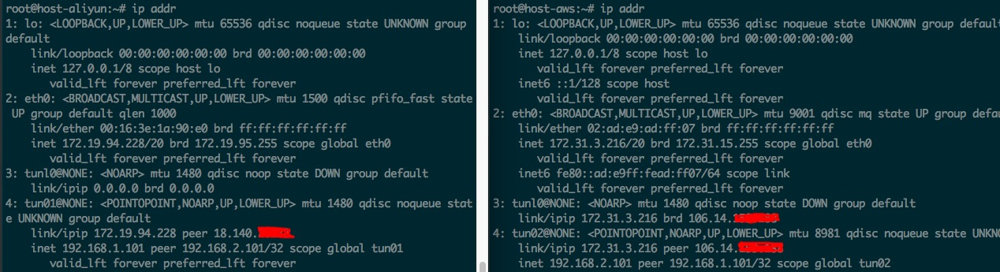
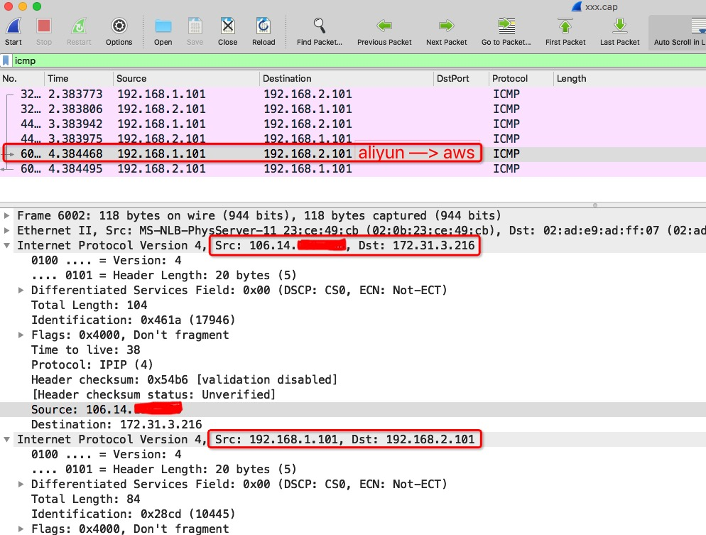

## 实验：阿里云和aws主机搭建ipip tunnel

> 2台分布在阿里云和aws上的机器，分别部署了不同的服务。
>
> 它们需要互相访问，但是又不想开放公网访问，这个时候就可以搭建ip隧道，通过隧道来访问。
>
> 点对点的访问，虽然性能不优，但是能满足基本的访问需求。


### 实验准备

- aliyun机器：
  - 外网IP：`106.14.x.xxx`
  - 内网IP：`172.19.94.228/20`
- aws机器：
  - 外网IP：`18.140.x.xxx`
  - 内网IP：`172.31.3.216/20`


### 创建ipip tunnel


#### 加载ipip模块

- aliyun机器：

  ```bash
  root@host-aliyun:~# lsmod | grep ipip
  root@host-aliyun:~# modprobe ipip
  root@host-aliyun:~# lsmod | grep ipip
  ipip                   12934  0
  tunnel4                12629  1 ipip
  ip_tunnel              21463  1 ipip
  ```

- aws机器：

  ```bash
  root@host-aws:~# lsmod | grep ipip
  root@host-aws:~# modprobe ipip
  root@host-aws:~# lsmod | grep ipip
  ipip                   13465  0
  tunnel4                13252  1 ipip
  ip_tunnel              23760  1 ipip
  ```

#### 创建ipip tunnel

- aliyun机器：

  ```bash
  ip tunnel add tun01 mode ipip remote 18.140.x.xxx local 172.19.94.228
  ip link set tun01 up
  ip addr add 192.168.1.101 peer 192.168.2.101 dev tun01
  ```

- aws机器：

  ```bash
  ip tunnel add tun02 mode ipip remote 106.14.x.xxx local 172.31.3.216
  ip link set tun02 up
  ip addr add 192.168.2.101 peer 192.168.1.101 dev tun02
  ```

- 查看ip addr：

  ```bash
  ip addr
  ```

  


#### 执行ping

- aliyun上执行ping：

  ```bash
  root@host-aliyun:~# ping 192.168.2.101
  PING 192.168.2.101 (192.168.2.101) 56(84) bytes of data.
  ^C
  --- 192.168.2.101 ping statistics ---
  4 packets transmitted, 0 received, 100% packet loss, time 3022ms
  ```

- **开启ip_forward:**

  - aliyun上执行：

    ```bash
    root@host-aliyun:~# cat /proc/sys/net/ipv4/ip_forward
    0
    root@host-aliyun:~# echo 1 > /proc/sys/net/ipv4/ip_forward
    root@host-aliyun:~# sysctl -a | grep ip_forward
    net.ipv4.ip_forward = 1
    net.ipv4.ip_forward_use_pmtu = 0
    ```

  - aws上执行：

    ```bash
    root@host-aws:~# sysctl -a | grep ip_forward
    net.ipv4.ip_forward = 0
    root@host-aws:~# echo 1 > /proc/sys/net/ipv4/ip_forward
    root@host-aws:~# sysctl -a | grep ip_forward
    net.ipv4.ip_forward = 1
    ```

- 再次执行`ping`:

  - aliyun上执行：

    ```bash
    root@host-aliyun:~# ping -c 3 192.168.2.101
    PING 192.168.2.101 (192.168.2.101) 56(84) bytes of data.
    64 bytes from 192.168.2.101: icmp_seq=1 ttl=64 time=64.8 ms
    64 bytes from 192.168.2.101: icmp_seq=2 ttl=64 time=64.2 ms
    64 bytes from 192.168.2.101: icmp_seq=3 ttl=64 time=68.2 ms
    
    --- 192.168.2.101 ping statistics ---
    3 packets transmitted, 3 received, 0% packet loss, time 2001ms
    rtt min/avg/max/mdev = 64.293/65.785/68.206/1.727 ms
    ```

  - aws上执行：

    ```bash
    root@host-aws:~# ping -c 3 192.168.1.101
    PING 192.168.1.101 (192.168.1.101) 56(84) bytes of data.
    64 bytes from 192.168.1.101: icmp_seq=1 ttl=64 time=64.1 ms
    64 bytes from 192.168.1.101: icmp_seq=2 ttl=64 time=70.6 ms
    64 bytes from 192.168.1.101: icmp_seq=3 ttl=64 time=70.4 ms
    
    --- 192.168.1.101 ping statistics ---
    3 packets transmitted, 3 received, 0% packet loss, time 2002ms
    rtt min/avg/max/mdev = 64.197/68.408/70.608/2.986 ms
    ```

#### 抓包分析

- aliyun执行：`ping -c 3 192.168.2.101`
- aws执行：`tcpdump -n -w test.cap`




#### 清理

- aliyun机器：

  ```bash
  ip link delete dev tun01
  rmmod ipip
  echo 0 > /proc/sys/net/ipv4/ip_forward
  ```

- aws机器：

  ```bash
  ip link delete dev tun02
  rmmod ipip
  echo 0 > /proc/sys/net/ipv4/ip_forward
  ```

  

