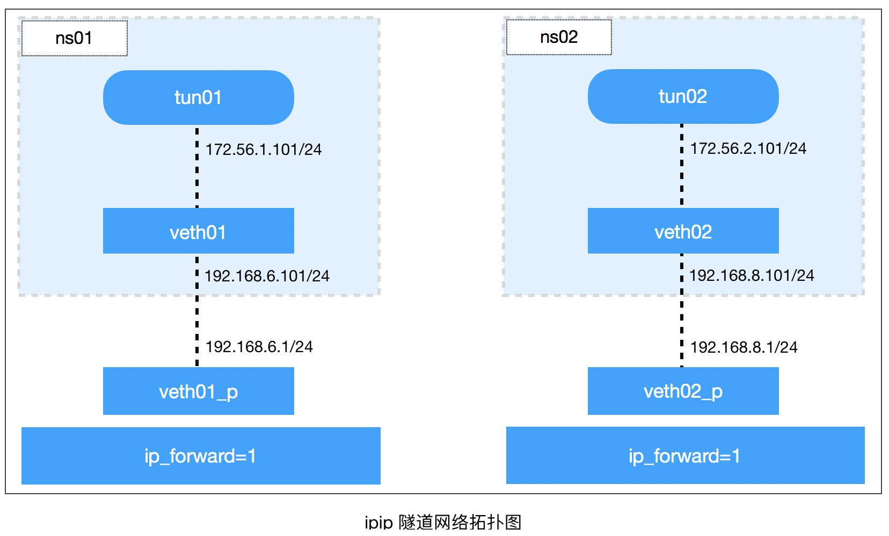
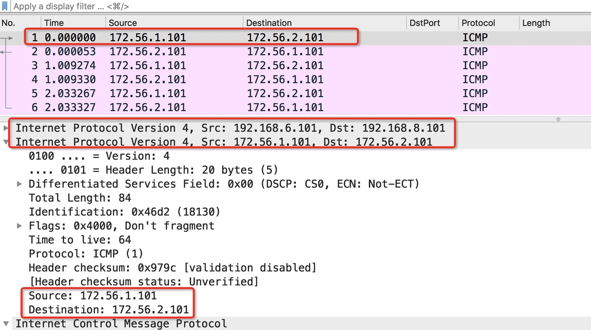

## ipip tunnel

> `tun`经常被用来做隧道通信(`tunnel`)，所以`tun`设备也叫点对点设备。

`ip tunnel help`：查看IP隧道的相关操作，Linux原生支持5种L3隧道：

- `ipip`: 即`IPv4 in IPv4`，即`IPv4`报文的基础上封装一个`IPv4`报文;
- `GRE`: 即`Generic Routing Encapsulation`(通用路由封装)，定义了在任意一种网络层协议上封装其他任意一种网络层协议的机制，适用于`IPv4`和`IPv6`
- `sit`: 和`ipip`类似，不同的是`sit`用`IPv4`报文封装`IPv6`报文，即`IPv6 Over IPv4`
- `ISATAP`: 即`Intra-Site Automatic Tunnel Addressing Protocol`(站内自动隧道寻址协议)，与`sit`类似，也用于`IPv6`的隧道封装。

### 加载ipip模块

- 检查内核是否加载了`ipip`相关模块：

  ```bash
  lsmod | grep ipip
  ```

- 加载`ipip`模块

  ```bash
  modprobe ipip
  ```

- 查看ipip

  ```bash
  # lsmod | grep ipip
  ipip                   16384  0
  tunnel4                16384  1 ipip
  ip_tunnel              28672  1 ipip
  ```

- 移除内核模块：

  ```bash
  rmmod ipip
  ```

#### 创建ipip隧道

> 加载了ipip内核模块后，就可以创建隧道了。
>
> **方法：**
>
> 1. 先创建一个`tun`设备
> 2. 将该tun设备绑定为一个`ipip`隧道

---

### 2台主机之间创建ip tunnel

> 首先开启内核模块ipip.ko的支持。
>
> ```bash
> root@ubuntu:~# lsmod | grep ipip
> root@ubuntu:~# modprobe ipip
> root@ubuntu:~# lsmod | grep ipip
> ipip                   16384  0
> tunnel4                16384  1 ipip
> ip_tunnel              24576  1 ipip
> ```

**如果要移除内核加载的模块，可用：`rmmod ipip`**


#### 创建ipip tunnel

- **`Host-01`执行：**

  ```bash
  ip tunnel add tun01 mode ipip remote 192.168.1.129 local 10.90.6.238
  ip link set tun01 up
  ip addr add 172.66.1.101 peer 172.66.2.101 dev tun01
  ip addr
  ```

- **`Host-02`执行：**

  ```bash
  ip tunnel add tun02 mode ipip remote 10.90.6.238 local 192.168.1.129
  ip link set tun02 up
  ip addr add 172.66.2.101 peer 172.66.1.101 dev tun02
  ip addr
  ```

- **检查/开启ip_forward：**

  ```bash
  cat /proc/sys/net/ipv4/ip_forward
  echo 1 > /proc/sys/net/ipv4/ip_forward
  
  sysctl -a | grep ip_forward
  ```

#### 执行ping操作

> `Host-01`: 执行` ping -c 3 172.66.2.101`和`tcpdump -n -i tun01`
>
> `Host-02`: 执行`tcpdump -n -i tun02`

- `Host-01`执行ping：

  ```bash
  root@ubuntu238:~# ping -c 3 172.66.2.101
  PING 172.66.2.101 (172.66.2.101) 56(84) bytes of data.
  64 bytes from 172.66.2.101: icmp_seq=1 ttl=64 time=0.320 ms
  64 bytes from 172.66.2.101: icmp_seq=2 ttl=64 time=0.256 ms
  64 bytes from 172.66.2.101: icmp_seq=3 ttl=64 time=0.789 ms
  
  --- 172.66.2.101 ping statistics ---
  3 packets transmitted, 3 received, 0% packet loss, time 2074ms
  rtt min/avg/max/mdev = 0.256/0.455/0.789/0.237 ms
  ```

- `Host-01`执行抓包：

  ```bash
  root@ubuntu238:~# tcpdump -n -i tun01
  tcpdump: verbose output suppressed, use -v or -vv for full protocol decode
  listening on tun01, link-type RAW (Raw IP), capture size 262144 bytes
  17:42:35.583003 IP 172.66.1.101 > 172.66.2.101: ICMP echo request, id 18766, seq 1, length 64
  17:42:35.583201 IP 172.66.2.101 > 172.66.1.101: ICMP echo reply, id 18766, seq 1, length 64
  17:42:36.583600 IP 172.66.1.101 > 172.66.2.101: ICMP echo request, id 18766, seq 2, length 64
  17:42:36.583810 IP 172.66.2.101 > 172.66.1.101: ICMP echo reply, id 18766, seq 2, length 64
  17:42:37.607561 IP 172.66.1.101 > 172.66.2.101: ICMP echo request, id 18766, seq 3, length 64
  17:42:37.607733 IP 172.66.2.101 > 172.66.1.101: ICMP echo reply, id 18766, seq 3, length 64
  ```

- `Host-02`执行：

  ```bash
  root@ubuntu129:~# tcpdump -n -i tun02
  tcpdump: verbose output suppressed, use -v or -vv for full protocol decode
  listening on tun02, link-type RAW (Raw IP), capture size 262144 bytes
  17:38:19.671629 IP 172.66.1.101 > 172.66.2.101: ICMP echo request, id 18275, seq 1, length 64
  17:38:19.671663 IP 172.66.2.101 > 172.66.1.101: ICMP echo reply, id 18275, seq 1, length 64
  17:38:20.721720 IP 172.66.1.101 > 172.66.2.101: ICMP echo request, id 18275, seq 2, length 64
  17:38:20.721749 IP 172.66.2.101 > 172.66.1.101: ICMP echo reply, id 18275, seq 2, length 64
  17:38:21.746206 IP 172.66.1.101 > 172.66.2.101: ICMP echo request, id 18275, seq 3, length 64
  17:38:21.746230 IP 172.66.2.101 > 172.66.1.101: ICMP echo reply, id 18275, seq 3, length 64
  ```

#### 抓包

> 执行：`tcpdump -n -i eth0 -w ipip-test.cap`
>
> 然后用Wireshark打开查看。

#### 清理：

> 如果要关闭ipip模块，执行`rmmod ipip`

- `Host-01`清理命令:

  ```bash
  ip link delete tun01
  ```

- `Host-02`清理命令：

  ```bash
  ip link delete tun02
  ```

---

### 不同Network Namespace使用ipip隧道

**注意：**不同操作系统，不同内核版本可能会有差异(甚至会出现不成功的状况)。



#### 实验准备：

> 先让`192.168.6.101`与`192.168.8.101`互通。

- 查看操作系统信息：

  ```bash
  root@ubuntu:~# uname -a
  Linux ubuntu 4.20.17-042017-lowlatency #201903190933 SMP PREEMPT Tue Mar 19 13:46:27 UTC 2019 x86_64 x86_64 x86_64 GNU/Linux
  root@ubuntu:~# cat /etc/issue
  Ubuntu 16.04.4 LTS \n \l
  ```

- 创建2个network namespace:

  ```bash
  ip netns add ns01
  ip netns add ns02
  ```

- 创建两对veth：

  ```bash
  ip link add veth01 type veth peer name veth01_p
  ip link add veth02 type veth peer name veth02_p
  ```

- 把veth01和veth02分别移至ns01和ns02：

  ```bash
  ip link set veth01 netns ns01
  ip link set veth02 netns ns02
  ```

- 设置veth pair的IP地址：

  **设置network namespace中的IP地址：**

  ```bash
  ip netns exec ns01 ip addr add 192.168.6.101/24 dev veth01
  ip netns exec ns01 ip link set veth01 up
  # ip netns exec ns01 ifconfig veth01 192.168.6.101/up
  
  ip netns exec ns02 ip addr add 192.168.8.101/24 dev veth02
  ip netns exec ns02 ip link set veth02 up
  # ip netns exec ns02 ifconfig 192.168.8.101/24 up
  ```

  **设置veth pair对端的IP地址：**

  ```bash
  ifconfig veth01_p 192.168.6.1/24 up
  ifconfig veth02_p 192.168.8.1/24 up
  ```

- 查看IP：

  ```bash
  ip addr
  ip netns exec ns01 ip addr
  ip netns exec ns02 ip addr
  ```

**测试ping：**

- `veth01 ping veth02`:

  ```bash
  # ip netns exec ns01 ping -c 3 192.168.8.101
  connect: Network is unreachable
  ```

- 检查`ip_forward`

  ```bash
  cat /proc/sys/net/ipv4/ip_forward
  echo 1 > /proc/sys/net/ipv4/ip_forward
  
  sysctl -a | grep ip_forward
  ```

  可添加`net.ipv4.ip_forward`到`/etc/sysctl.conf`中。

  **经过检查还是ping不同**，这个时候可以查看路由了。

- 设置路由：

  - 查看`ns01`，`ns02`的路由：

    ```bash
    # ip netns exec ns01 ip route
    192.168.6.0/24 dev veth01  proto kernel  scope link  src 192.168.6.101
    
    # ip netns exec ns02 ip route
    192.168.8.0/24 dev veth02  proto kernel  scope link  src 192.168.8.101
    ```

    发现：

    - `ns01`无通往`192.168.8.0/24`网段的路由
    - `ns02`无通往`192.168.6.0/24`网段的路由

  - 设置路由：

    ```bash
    ip netns exec ns01 ip route add 192.168.8.0/24 via 192.168.6.1
    ip netns exec ns02 ip route add 192.168.6.0/24 via 192.168.8.1
    ```

  - 发现还是无法转发：

    **iptables添加如下规则：**

    ```bash
    iptables -A FORWARD -i veth01_p -o veth02_p -j ACCEPT
    iptables -A FORWARD -i veth02_p -o veth01_p -j ACCEPT
    ```

  - 再次执行ping：

    `ns01`到`veth02`:

    ```bash
    # ip netns exec ns01 ping -c 1  192.168.8.101
    PING 192.168.8.101 (192.168.8.101) 56(84) bytes of data.
    64 bytes from 192.168.8.101: icmp_seq=1 ttl=63 time=0.063 ms
    
    --- 192.168.8.101 ping statistics ---
    1 packets transmitted, 1 received, 0% packet loss, time 0ms
    rtt min/avg/max/mdev = 0.063/0.063/0.063/0.000 ms
    ```

    `ns02`到`veth01`:

    ```bash
    # ip netns exec ns02 ping -c 1  192.168.6.101
    PING 192.168.6.101 (192.168.6.101) 56(84) bytes of data.
    64 bytes from 192.168.6.101: icmp_seq=1 ttl=63 time=0.053 ms
    
    --- 192.168.6.101 ping statistics ---
    1 packets transmitted, 1 received, 0% packet loss, time 0ms
    rtt min/avg/max/mdev = 0.053/0.053/0.053/0.000 ms
    ```

#### 创建ipip tunnel

> **注意：**需要先确保`veth01`和`veth02`互通之后，我们再创建`tun`设备，并设置为`ipip tunnel`

- 创建`tun`设备：

  > 在`ns01`的network namespace中创建`tun`设备`tun01`，并设置隧道模式为`ipip`
  >
  > 然后设置隧道端点，用`remote`和`local`表示，这个是隧道外层的`IP`。
  >
  > 隧道内层IP用`ip addr add xxx peer xxx`配置。

  ```bash
  ip netns exec ns01 ip tunnel add tun01 mode ipip remote 192.168.8.101 local 192.168.6.101
  ```

  启动`tun`设备，并配置隧道内层的IP：

  ```bash
  ip netns exec ns01 ip link set tun01 up
  ip netns exec ns01 ip addr add 172.56.1.101 peer 172.56.2.101 dev tun01
  ```

- 然后继续在`ns01`中添加`tun02`：

  ```bash
  ip netns exec ns02 ip tunnel add tun02 mode ipip remote 192.168.6.101 local 192.168.8.101
  ip netns exec ns02 ip link set dev tun02 up
  ip netns exec ns02 ip addr add 172.56.2.101 peer 172.56.1.101 dev tun02
  ```

- 查看ip addr：

  - `ns01`:

    ```bash
    # ip netns exec ns01 ip addr
    1: lo: <LOOPBACK> mtu 65536 qdisc noop state DOWN group default qlen 1
        link/loopback 00:00:00:00:00:00 brd 00:00:00:00:00:00
    2: tunl0@NONE: <NOARP> mtu 1480 qdisc noop state DOWN group default qlen 1
        link/ipip 0.0.0.0 brd 0.0.0.0
    4: tun01@NONE: <POINTOPOINT,NOARP,UP,LOWER_UP> mtu 1480 qdisc noqueue state UNKNOWN group default qlen 1
        link/ipip 192.168.6.101 peer 192.168.8.101
        inet 172.56.1.101 peer 172.56.2.101/32 scope global tun01
           valid_lft forever preferred_lft forever
    13: veth01@if12: <BROADCAST,MULTICAST,UP,LOWER_UP> mtu 1500 qdisc noqueue state UP group default qlen 1000
        link/ether ee:72:6e:30:da:92 brd ff:ff:ff:ff:ff:ff link-netnsid 0
        inet 192.168.6.101/24 scope global veth01
           valid_lft forever preferred_lft forever
        inet6 fe80::ec72:6eff:fe30:da92/64 scope link
           valid_lft forever preferred_lft forever
    ```

  - `ns02`:

    ```bash
    # ip netns exec ns02 ip addr
    1: lo: <LOOPBACK> mtu 65536 qdisc noop state DOWN group default qlen 1
        link/loopback 00:00:00:00:00:00 brd 00:00:00:00:00:00
    2: tunl0@NONE: <NOARP> mtu 1480 qdisc noop state DOWN group default qlen 1
        link/ipip 0.0.0.0 brd 0.0.0.0
    4: tun02@NONE: <POINTOPOINT,NOARP,UP,LOWER_UP> mtu 1480 qdisc noqueue state UNKNOWN group default qlen 1
        link/ipip 192.168.8.101 peer 192.168.6.101
        inet 172.56.2.101 peer 172.56.1.101/32 scope global tun02
           valid_lft forever preferred_lft forever
    15: veth02@if14: <BROADCAST,MULTICAST,UP,LOWER_UP> mtu 1500 qdisc noqueue state UP group default qlen 1000
        link/ether c2:94:b6:a2:e4:d1 brd ff:ff:ff:ff:ff:ff link-netnsid 0
        inet 192.168.8.101/24 scope global veth02
           valid_lft forever preferred_lft forever
        inet6 fe80::c094:b6ff:fea2:e4d1/64 scope link
           valid_lft forever preferred_lft forever
    ```

- 测试`tun01`和`tun02`的互通：

  - `ns01 ping ns02`:

    ```bash
    root@ubuntu:~# ip netns exec ns01 ping -c 3 172.56.2.101
    PING 172.56.2.101 (172.56.2.101) 56(84) bytes of data.
    64 bytes from 172.56.2.101: icmp_seq=1 ttl=64 time=0.113 ms
    64 bytes from 172.56.2.101: icmp_seq=2 ttl=64 time=0.107 ms
    64 bytes from 172.56.2.101: icmp_seq=3 ttl=64 time=0.094 ms
    
    --- 172.56.2.101 ping statistics ---
    3 packets transmitted, 3 received, 0% packet loss, time 2042ms
    rtt min/avg/max/mdev = 0.094/0.104/0.113/0.014 ms
    ```

  - `ns02 ping ns01`

    ```bash
    root@ubuntu:~# ip netns exec ns02 ping -c 3 172.56.1.101
    PING 172.56.1.101 (172.56.1.101) 56(84) bytes of data.
    64 bytes from 172.56.1.101: icmp_seq=1 ttl=64 time=0.199 ms
    64 bytes from 172.56.1.101: icmp_seq=2 ttl=64 time=0.106 ms
    64 bytes from 172.56.1.101: icmp_seq=3 ttl=64 time=0.071 ms
    
    --- 172.56.1.101 ping statistics ---
    3 packets transmitted, 3 received, 0% packet loss, time 2068ms
    rtt min/avg/max/mdev = 0.071/0.125/0.199/0.054 ms
    ```

  - 抓包查看：

    ```bash
    tcpdump -n -i veth01_p -w test.cap
    ```

    

    **注意到：**

    - 在IP层是有2层的：
    - 外层是：`192.168.6.101` --> `192.168.8.101`
    - 内层是：`172.56.1.101` ---> `172.56.2.101`

#### 清理

```bash
# 删除veth pari
ip link delete dev veth01_p
ip link delete dev veth02_p

# 删除network namespace
ip netns delete ns01
ip netns delete ns02

# 清除iptables
iptables -D FORWARD -i veth01_p -o veth02_p -j ACCEPT
iptables -D FORWARD -i veth02_p -o veth01_p -j ACCEPT

# 删除tun设备
ip netns exec ns01 ip link delete dev tun01
ip netns exec ns02 ip link delete dev tun02
```

