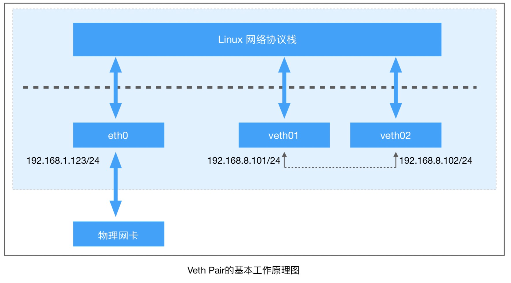

## veth pair

> veth是虚拟以太网卡(Virtual Ethernet)的缩写。


### veth的特点

1. veth设备总是成对出现：`veth pair`
2. `veth pair`一端发出的数据包，会直接出现在另外一张网卡上(即使不同的 Network Namespace)
3. 常结合网桥使用，把一端接入到网桥(Bridge)设备中

### 操作veth

- 创建veth pair

  ```bash
  ip link add veth01 type veth peer name veth02
  ```

  - 创建veth pair前查看`ip link list`

    ```bash
    root@ubuntu:~# ip link list
    # ....
    1: lo: <LOOPBACK,UP,LOWER_UP> mtu 65536 qdisc noqueue state UNKNOWN mode DEFAULT group default qlen 1
        link/loopback 00:00:00:00:00:00 brd 00:00:00:00:00:00
    2: eth0: <BROADCAST,MULTICAST,UP,LOWER_UP> mtu 1500 qdisc pfifo_fast state UP mode DEFAULT group default qlen 1000
        link/ether 00:50:56:9d:13:1d brd ff:ff:ff:ff:ff:ff
    3: docker0: <NO-CARRIER,BROADCAST,MULTICAST,UP> mtu 1500 qdisc noqueue state DOWN mode DEFAULT group default
        link/ether 02:42:20:82:b9:d1 brd ff:ff:ff:ff:ff:ff
    ```

  - 创建完veth pair后查看：

    多出了2条：

    ```bash
    root@ubuntu:~# ip link list
    # ....
    4: veth02@veth01: <BROADCAST,MULTICAST,M-DOWN> mtu 1500 qdisc noop state DOWN mode DEFAULT group default qlen 1000
        link/ether 96:a0:b6:06:77:09 brd ff:ff:ff:ff:ff:ff
    5: veth01@veth02: <BROADCAST,MULTICAST,M-DOWN> mtu 1500 qdisc noop state DOWN mode DEFAULT group default qlen 1000
        link/ether ca:f8:bb:d1:eb:da brd ff:ff:ff:ff:ff:ff
    ```

    新创建的`veth pari`设备默认`mtu`是1500，设备状态是`DOWN`。

- 配置veth pair

  - 设置状态为up

    ```bash
    # ip link set dev veth01  up
    # ip link set dev veth02  up
    ```

  - 设置IP：

    ```bash
    # ifconfig veth01 192.168.8.101/24
    # ifconfig veth02 192.168.8.102/24
    ```

  - 也可以把上面2步结合为一步操作：

    ```bash
    # ifconfig veth01 192.168.8.101/24 up
    # ifconfig veth02 192.168.8.102/24 up
    ```

  - 查看ip address

    ```bash
    root@ubuntu:~# ip addr
    1: lo: <LOOPBACK,UP,LOWER_UP> mtu 65536 qdisc noqueue state UNKNOWN group default qlen 1
        link/loopback 00:00:00:00:00:00 brd 00:00:00:00:00:00
        inet 127.0.0.1/8 scope host lo
           valid_lft forever preferred_lft forever
        inet6 ::1/128 scope host
           valid_lft forever preferred_lft forever
           
    2: eth0: <BROADCAST,MULTICAST,UP,LOWER_UP> mtu 1500 qdisc pfifo_fast state UP group default qlen 1000
        link/ether 00:50:56:9d:13:1d brd ff:ff:ff:ff:ff:ff
        inet 192.168.1.123/20 brd 10.90.15.255 scope global ens192
           valid_lft forever preferred_lft forever
        inet6 fe80::250:56ff:fe9d:131d/64 scope link
           valid_lft forever preferred_lft forever
    3: docker0: <NO-CARRIER,BROADCAST,MULTICAST,UP> mtu 1500 qdisc noqueue state DOWN group default
        link/ether 02:42:20:82:b9:d1 brd ff:ff:ff:ff:ff:ff
        inet 172.17.0.1/16 scope global docker0
           valid_lft forever preferred_lft forever
           
    4: veth02@veth01: <BROADCAST,MULTICAST,UP,LOWER_UP> mtu 1500 qdisc noqueue state UP group default qlen 1000
        link/ether 96:a0:b6:06:77:09 brd ff:ff:ff:ff:ff:ff
        inet 192.168.8.102/24 brd 192.168.8.255 scope global veth02
           valid_lft forever preferred_lft forever
        inet6 fe80::94a0:b6ff:fe06:7709/64 scope link
           valid_lft forever preferred_lft forever
    5: veth01@veth02: <BROADCAST,MULTICAST,UP,LOWER_UP> mtu 1500 qdisc noqueue state UP group default qlen 1000
        link/ether ca:f8:bb:d1:eb:da brd ff:ff:ff:ff:ff:ff
        inet 192.168.8.101/24 brd 192.168.8.255 scope global veth01
           valid_lft forever preferred_lft forever
        inet6 fe80::c8f8:bbff:fed1:ebda/64 scope link
           valid_lft forever preferred_lft forever
    ```

  ### veth pair原理

  > veth pair 设备的原理比较简单:
  >
  > 就是向veth pair设备的一端输入的数据包，数据包通过内核协议栈从veth pair的另一端出来。

  

  **veth pair 在转发过程中不会篡改数据包的内容。**

### veth pair互ping

- 执行ping命令：

  ```bash
  # ping -c 3 -I veth01 192.168.8.102
  PING 192.168.8.102 (192.168.8.102) from 192.168.8.101 veth01: 56(84) bytes of data.
  From 192.168.8.101 icmp_seq=1 Destination Host Unreachable
  From 192.168.8.101 icmp_seq=2 Destination Host Unreachable
  From 192.168.8.101 icmp_seq=3 Destination Host Unreachable
  
  --- 192.168.8.102 ping statistics ---
  3 packets transmitted, 0 received, +3 errors, 100% packet loss, time 2014ms
  pipe 3
  ```

  

- tcpdump查看原因：

  > 开3个窗口分别执行：
  >
  > ping -c 3 -I veth01 192.168.8.102
  >
  > tcpdump -n -i veth01
  >
  > tcpdump -n -i veth02

  **抓取veth01的包：**

  ```bash
  root@ubuntu:~# tcpdump -n -i veth01
  tcpdump: verbose output suppressed, use -v or -vv for full protocol decode
  listening on veth01, link-type EN10MB (Ethernet), capture size 262144 bytes
  18:12:01.440059 ARP, Request who-has 192.168.8.102 tell 192.168.8.101, length 28
  18:12:02.438733 ARP, Request who-has 192.168.8.102 tell 192.168.8.101, length 28
  18:12:03.438735 ARP, Request who-has 192.168.8.102 tell 192.168.8.101, length 28
  ```

  **同时开个窗口抓取veth02的包：**

  ```bash
  root@ubuntu:~# tcpdump -n -i veth02
  tcpdump: verbose output suppressed, use -v or -vv for full protocol decode
  listening on veth02, link-type EN10MB (Ethernet), capture size 262144 bytes
  18:12:01.440065 ARP, Request who-has 192.168.8.102 tell 192.168.8.101, length 28
  18:12:02.438739 ARP, Request who-has 192.168.8.102 tell 192.168.8.101, length 28
  18:12:03.438743 ARP, Request who-has 192.168.8.102 tell 192.168.8.101, length 28
  ```

- 修改参数：

  **这里ping不通的原因是内核相关的配置。**

  ```bash
  cat /proc/sys/net/ipv4/conf/veth01/accept_local
  cat /proc/sys/net/ipv4/conf/veth02/accept_local
  # 由0设置为1
  echo 1 > /proc/sys/net/ipv4/conf/veth01/accept_local
  echo 1 > /proc/sys/net/ipv4/conf/veth02/accept_local
  
  cat /proc/sys/net/ipv4/conf/all/rp_filter
  cat /proc/sys/net/ipv4/conf/veth01/rp_filter
  cat /proc/sys/net/ipv4/conf/veth02/rp_filter
  # 由1改成0
  echo 0 > /proc/sys/net/ipv4/conf/all/rp_filter
  echo 0 > /proc/sys/net/ipv4/conf/veth01/rp_filter
  echo 0 > /proc/sys/net/ipv4/conf/veth02/rp_filter
  ```

  - `accept_local`: 检测源IP地址的机制
    - accept_local可以改变默认的行为:
      - 把它设为1则接受源IP是本机中的IP的报文通过
      - 默认是0，源IP是本机中的IP的报文就丢弃掉了
    - 若收到的IP报文源IP与本机上某一个IP相同，那么内核默认丢弃这个报文
  - `rp_filter`: 用于控制系统是否开启对数据包源地址的校验

- 再次执行ping：

  ```bash
  # ping -c 3 -I veth01 192.168.8.102
  PING 192.168.8.102 (192.168.8.102) from 192.168.8.101 veth01: 56(84) bytes of data.
  64 bytes from 192.168.8.102: icmp_seq=1 ttl=64 time=0.037 ms
  64 bytes from 192.168.8.102: icmp_seq=2 ttl=64 time=0.061 ms
  64 bytes from 192.168.8.102: icmp_seq=3 ttl=64 time=0.047 ms
  
  --- 192.168.8.102 ping statistics ---
  3 packets transmitted, 3 received, 0% packet loss, time 1998ms
  rtt min/avg/max/mdev = 0.037/0.048/0.061/0.011 ms
  ```

  如果还抓着包的话就可看到：

  ```
  18:27:35.733806 ARP, Reply 192.168.8.102 is-at 76:b2:2b:1a:93:1e, length 28
  18:27:35.733811 IP 192.168.8.101 > 192.168.8.102: ICMP echo request, id 39994, seq 1, length 64
  18:27:36.734797 IP 192.168.8.101 > 192.168.8.102: ICMP echo request, id 39994, seq 2, length 64
  18:27:37.734800 IP 192.168.8.101 > 192.168.8.102: ICMP echo request, id 39994, seq 3, length 64
  ```

  

### 结合network namespace

- 创建2个network namespace

  ```bash
  ip netns add study01
  ip netns add study02
  ```

- 把`veth01`移动到`study01`

  ```bash
  ip link set veth01 netns study01
  ```

- 设置veth01的ip

  由于移动了namespace，网卡状态为DOWN了。

  ```bash
  ip netns exec study01 ifconfig veth01 192.168.8.101/24 up
  ```

- 执行ping操作：

  ```bash
  root@ubuntu:~# ip netns exec study01 ping 192.168.8.102
  PING 192.168.8.102 (192.168.8.102) 56(84) bytes of data.
  64 bytes from 192.168.8.102: icmp_seq=1 ttl=64 time=0.094 ms
  64 bytes from 192.168.8.102: icmp_seq=2 ttl=64 time=0.061 ms
  ```

- 使用`ethtool -S`查看veth pair的对端网卡index：

  ```bash
  root@ubuntu:~# ip netns exec study01 ethtool -S veth01
  NIC statistics:
       peer_ifindex: 4
  ```

  查看主机的网卡：

  ```bash
  root@ubuntu:~# ip addr
  # ....
  4: veth02@if5: <BROADCAST,MULTICAST,UP,LOWER_UP> mtu 1500 qdisc noqueue state UP group default qlen 1000
      link/ether 96:a0:b6:06:77:09 brd ff:ff:ff:ff:ff:ff link-netnsid 0
      inet 192.168.8.102/24 brd 192.168.8.255 scope global veth02
         valid_lft forever preferred_lft forever
      inet6 fe80::94a0:b6ff:fe06:7709/64 scope link
         valid_lft forever preferred_lft forever
  
  root@ubuntu:~# ethtool -S veth02
  NIC statistics:
       peer_ifindex: 5
  ```

### 清理操作

- 删除Network Namespace和veth pair

  ```bash
  # 删除veth peer：
  ip link delete dev veth01
  
  # 删除network namespace
  ip netns delete study01
  ip netns delete study02
  ```

  

